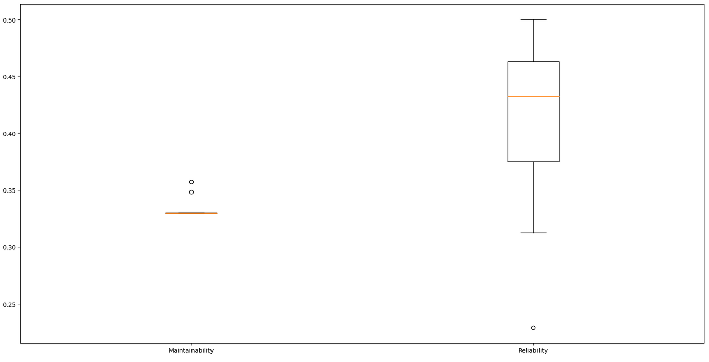

# Documento de Analytics
 
### Objetivo

 Este documento mostra por meio de análise de dados do sonarcloud e com auxílio do notebook da matéria, como está o andamento do time em relação ao padrão de qualidade do qRapids.

 
### Repositório Controle

 Abaixo podemos observar na cor laranja a reta que indica a confiabilidade do código, onde se manteve fixo no valor mais alto possível. E na cor azul, podemos observar a manutenibilidade do código que teve seu aprimoramento e depois seu decremento, pelo fato da métrica m2, onde houve a retirada de muitos comentários do código-fonte. De verde podemos ver a soma das duas medidas de qualidade.

 

 
### Repositório Front-end

 Na imagem podemos observar na cor laranja a reta que indica a confiabilidade do código, tendo discrepâncias ao passar do tempo, sendo que seu valor mais baixo, deve-se ao problema relacionado as falhas de testes inesperadas, porém foram corrigidas aumentando então seu valor. E na cor azul, podemos observar a manutenibilidade do código que teve um aumento no começo devido à métrica m2, e depois ficou fixo no valor de 0,33. De verde podemos ver a soma das duas medidas de qualidade.

 

 
### Qualidade agregada

 Abaixo, exibe-se os valores do indicador característico de qualidade agregada. Sendo que o repositório que obteve mais números de versões foi o Front-end. E em comparação com o outro repositório, podemos analisar pouca discrepância nos valores de manutenibilidade. Já na confiabilidade, observa-se uma grande discrepância dos valores, com o desvio padrão alcançando valores mais altos do que esperado, devido à oscilação dessa qualidade.

 

 
### Valores obtidos na planilha
 
<iframe src="https://docs.google.com/spreadsheets/d/e/2PACX-1vT_IGIEg2fVanXRPbyhs54cgEKox27sbYhURNjtt3HmOHfhR7xCBj8K4yOnNkl0aQ/pubhtml?gid=0&amp;single=true&amp;widget=true&amp;headers=false"width="100%" height="229px"></iframe>
 
 
 
## Versionamento
 
| Data | Versão | Descrição | Autor(es) |
|------|------|------|------|
|19/09/2022|1.0|Adiciona documento de analytics|[Bruno Nunes](https://github.com/brunocmo)
|19/09/2022|1.1|Revisão e Correção ortográfica|[Marcos Vinícius](https://github.com/marcos-mv)
 
 

