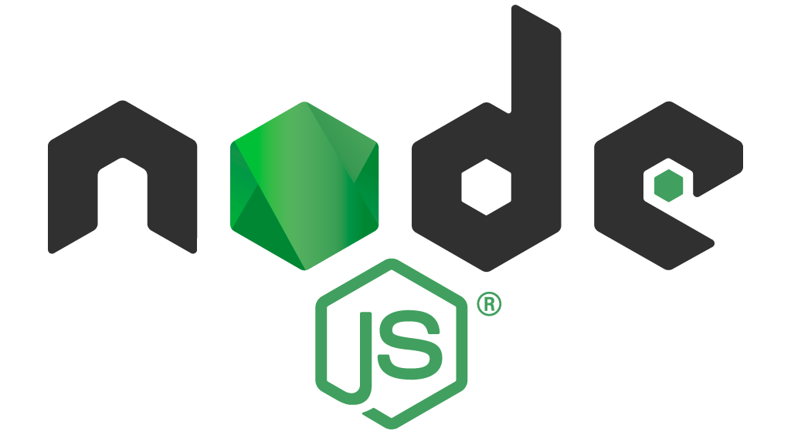
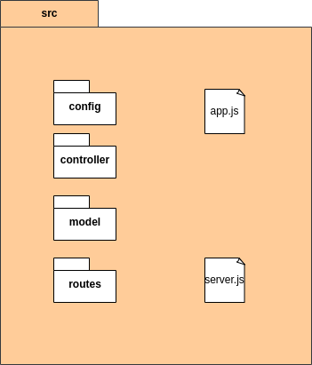
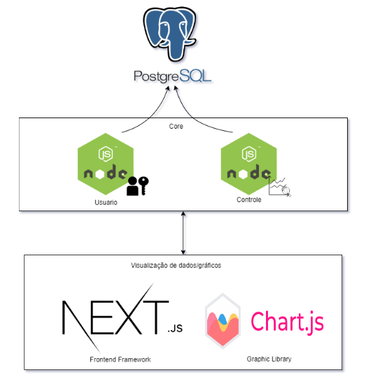
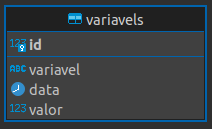
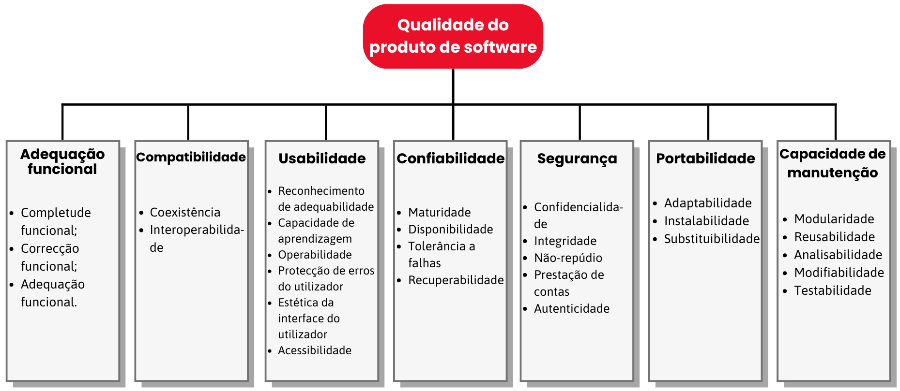

#   Arquitetura do projeto
 
### Finalidade
 

O documento estabelecerá uma visão da arquitetura de <em>software</em> adotada no sistema Visualeasy. Com isso ele tem como finalidade evidenciar com clareza as decisões arquiteturais que foram tomadas no projeto. Disponibilizando as informações essenciais para as pessoas desenvolvedoras e demais envolvidos a respeito da aplicação e das tecnologias que serão utilizadas no desenvolvimento do projeto.

 
### Escopo

 Essa documentação foi elaborada sobre a visão de arquitetura de <em>software</em> que será utilizada para a implementação do projeto Visualeasy, para a evidenciar as decisões tomadas. Serão abordados os padrões de arquitetura, os <em>frameworks</em> que serão usados no desenvolvimento do projeto. O objetivo é fornecer visualização gráfica de séries temporais, proporcionando uma melhor visualização dos dados fornecidos à aplicação e permitindo uma tomada de decisão com base na análise dos dados.

 

## Visão Geral
 

Aqui serão detalhados as características primordiais da arquitetura adotada pela equipe desenvolvedora. Estarão presentes a representação arquitetural, as restrições de arquitetura, visão lógica, de implementação e de dados.

 
### Representação da Arquitetura
 

Para o desenvolvimento do sistema Visualeasy, foi decidido a utilização de uma arquitetura em microsserviços. Microsserviços são uma abordagem arquitetônica e organizacional do desenvolvimento de <em>software</em>, onde o <em>software</em> consiste em pequenos serviços independentes que se comunicam usando APIs bem definidas. Esses serviços pertencem a pequenas equipes autossuficientes.

 

As arquiteturas de microsserviços facilitam a escalabilidade e agilizam o desenvolvimento de aplicativos, habilitando a inovação e acelerando o tempo de introdução de novos recursos no mercado.

 
No sistema Visualeasy foi decidido a criação de 3 microsserviços, sendo eles:
 
- **Frontend**: Responsável pela visualização de todo o sistema.
- **Controle**: Responsável pelo envio e tratamento dos dados de todas as variáveis que serão visualizadas nos gráficos.
- **Autenticação**: Responsável por lidar com a autenticação no sistema e com a criação dos perfis de usuário dentro do sistema.
 

A utilização de microsserviços traz como benefícios o desacoplamento das funcionalidades do sistema. Portanto, a alteração de um deles ou até mesmo a queda de algum deles, não afetará o resto do sistema, podendo as outras funcionalidades continuarem em execução normalmente.

 

Para o desenvolvimento dos microsserviços foi utilizado as seguintes tecnologias:

 
#### Node JS
 

 

Para o microsserviço de controle e de autenticação foi utilizado o Node.JS. Node é uma plataforma de aplicação, onde  programas são escritos em JS e compilados, otimizados e interpretados pela Máquina Virtual V8, sendo a mesma usada pelo Google para executar JavaScript no navegador Chrome. O resultado deste processo é entregue como código de máquina server-side, tornando o Node muito mais eficiente na sua execução e consumo de recursos. A plataforma Node foi escolhida por ser eficiente na implementação de aplicações em tempo real, que precisam transferir mensagens de um lado para o outro de forma rápida. As mensagens geradas pelo Visualeasy podem demandar um grande volume de dados a cada requisição do sistema.

 
#### Next.JS
 

 

Para o microsserviço responsável pelo front-end foi utilizado o NextJS. O Next.JS é um <em>framework</em> para React que é uma biblioteca javascript. O seu foco é no alto desempenho onde reúne diversas funcionalidades como renderização híbrida e estática de conteúdo. Possui suporte a TypeScript, pre-fetching, sistema de rotas, pacotes de funcionalidades e diversos plugins, o <em>framework</em> será utilizado, como parte front-end do nosso projeto, em que mostrará as telas e apresentará os recursos de gráfico, login dentre outras funcionalidades.

 
#### D3.js
 

Para a exibição dos gráficos foi escolhida a biblioteca D3.js. A D3.js é uma biblioteca em Javascript orientada a dados. Não é um <em>framework</em> monolítico, fornecendo uma melhor escalabilidade. D3 é rápido e trabalha com altos volumes de dados e interações com animações, assim evitando uma sobrecarga no sistema como um todo.

 
#### PostgreSQL
 

Para banco de dados foi escolhido o PostgreSQL. O PostgreSQL é um Sistema Gerenciador de Banco de Dados Relacional de código aberto que utiliza a linguagem SQL para armazenar seguramente os dados, extensível e possui um vasto ecossistema de ferramentas. É um software projetado para possuir compatibilidade com os principais sistemas operacionais como Linux e Windows. Por essas características esse Banco de Dados tem sido bastante utilizado no contexto geral de negócios, sites e por isso foi o escolhido como a solução de banco de dados do Visualeasy.

 
### Metas e restrições da arquitetura
 
Metas:

+ Funcionar nos principais browsers utilizados atualmente: Mozilla Firefox, Google Chrome e Microsoft Edge.
 
+ O código deve ser modularizado, facilitando a manutenção e com baixo acoplamento.
 
Restrições:

+ Conexão com a Internet;
+ Conexão com a API;
+ Conexão ao Banco de Dados;
 
### Ambiente e Ferramentas de Desenvolvimento
 
| Requisito | Ferramenta/Solução | Versão |Descrição |
|----|-----|---|---|
|Linguagem|Javascript|ES6|Linguagem de programação interpretada e multiparadigma|
|Framework|Node.js|16.16.0|Ambiente de execução Javascript server-side|
|Framework|Next.js|12.2.2|Framework React |
|Biblioteca|D3.js |7.6.1| Biblioteca Javascript orientada a dados|
|Base de dados|PostgreSQL|14|Sistema Gerenciador de Banco de Dados de código aberto|
|Virtualização|Docker|20.10.17|Plataforma aberta para empacotamento e execução de aplicações em contêineres|
|Virtualização|Docker-compose|3.9|Gerenciamento de contêiner|
|Biblioteca|Jest|28.1.3|Biblioteca de testes|
 
 

## Visão Lógica
 

Esta sessão apresenta os pacotes de design significativos do ponto de vista da arquitetura para o projeto Visualeasy.

 
### Pacotes Visualeasy (API)
 

 

Os pacotes mais significativos da API do Visualeasy são detalhados a seguir.

 
#### Model

A Model identifica as entidades a serem utilizadas na aplicação de maneira correlacionada com conceitos abstraídos das circunstâncias apresentadas no mundo real. Nessa camada também é implementado a comunicação com o banco de dados.

 
#### Controller
 

Dentro da controller ficam os arquivos responsáveis pela serialização dos dados. Serialização é o processo de conversão de um objeto em um fluxo de bytes para armazenar o objeto ou fluxo na memória, em um banco de dados, ou em um arquivo, ou transmiti-lo por uma conexão de rede, seja em forma binária ou em formato de texto como o JSON. Sua finalidade principal é salvar o estado de um objeto para ser capaz de recriá-lo quando necessário. Logo, é um método simples e robusto para tornar objetos persistentes.

 
#### Routes

Responsável por endereçar a lógica utilizando uma interface de comunicação baseada no protocolo HTTP. Processo realizado através do roteamento que determina como um aplicativo responde a uma solicitação do cliente, que vem através de um URI (caminho) e um método de solicitação HTTP específico (ex: GET, POST). Uma rota pode ter uma ou mais funções que são executadas quando a solicitação corresponde com o endereçamento da rota.

 
#### __tests__

Outro pacote tão importante quanto o da source são os de testes utilizando o jest.js, serão realizadas verificações de unidade e integração para garantir a qualidade do software entregue.

 

## Arquitetura dos Serviços e visão de Implementação
 
### Visão Geral
 

 
 
 
Cada microsserviço é detalhado da seguinte forma:
 
- 
Visualização de dados/gráficos : Front-end do produto composto pelo <em>framework</em> Next.Js, para a construção das telas, campos, validações e botões que o usuário irá interagir. Acompanhando o Next.Js, o D3.Js é responsável pela visualização dos dados tratados, gerando os gráficos.

- 
O Core é composto pelas APIs responsáveis pela autenticação de usuário e pelo controle, coleta de dados e geração de gráficos.

 

## Visão de Dados
 

Para a primeira versão da aplicação e para se adequar a questão do tempo disponível para a entrega. A visão de dados faz uma consulta a apenas a tabela "variavels" que possui atributos de acordo com o arquivo .csv disponibilizado pelo cliente para população e testes da aplicação.

 

 
Para atualizações futuras e conforme a necessidade para a implantação no sistema do cliente a estrutura do banco será baseada nesse diagrama lógico de dados.
 

 

## Qualidade
 

Para garantir a qualidade do sistema Visualeasy, serão seguidas 7 de 8  características de qualidade do produto de <i>software</i>, definidas pela ISO/IEC 25010. A norma ISO/IEC 25010 define as características de qualidade que todos os <i>softwares</i> devem ter, de forma a alcançar um nível muito alto de qualidade no <i>software</i> que será entregue.

Todas as características seguidas pelo projeto Visualeasy pode ser visualizadas na imagem abaixo, e em seguida cada tópico será detalhado, para melhor entendimento.

### Adequação Funcional

Esta característica representa o grau em que um produto ou sistema fornece funções que satisfazem as necessidades declaradas e implícitas quando utilizadas sob condições especificadas. Possui as seguintes subcaracterísticas:

+ 
<b>Completude funcional:</b> Onde o conjunto de funções cobre todas as tarefas especificadas, e os objetivos do usuário;

+ 
<b>Correção funcional:</b> Grau ao qual um produto ou sistema fornece os resultados corretos com o grau de precisão necessário;

+ 
<b>Adequação funcional:</b> Onde as funções facilitam a realização das tarefas e objetivos especificados.

### Compatibilidade

Capacidade de sistemas em trocar informações com outros sistemas, e/ou executar as suas funções necessárias enquanto partilha o mesmo ambiente de <i>hardware</i> ou <i>software</i>. É composta pelas seguintes subcaracterísticas:

+ 
<b>Coexistência:</b> Grau em que um produto pode desempenhar eficientemente as suas funções requeridas enquanto compartilha ambiente e recursos comuns com outros produtos, sem impacto prejudicial sobre qualquer outro produto.

+ 
<b>Interoperabilidade:</b> Grau em que dois ou mais sistemas podem trocar informação e utilizar a informação que foi trocada.

### Usabilidade

Característica de um sistema que pode ser utilizado por usuários para atingir objetivos específicos com eficácia, eficiência e satisfação num contexto de utilização especificado. Esta característica é composta pelas seguintes subcaracterísticas:

+ 
<b>Grau de reconhecimento de adequação:</b> Os utilizadores podem reconhecer se um sistema é apropriado para as suas necessidades;

+ 
<b>Capacidade de aprendizagem:</b> Grau ao qual um sistema pode ser utilizado por usuários especificados para atingir objetivos específicos de aprendizagem de utilização do produto com eficácia, eficiência, ausência de risco e satisfação num contexto de utilização especificado;

+ 
<b>Operabilidade:</b>Onde o sistema tem atributos que o tornam fácil de operar e controlar;

+ 
<b>Proteção contra erros do usuário:</b> Onde o sistema protege os usuários contra a ocorrência de erros;

+ 
<b>Estética da interface para o usuário:</b> Onde a interface permite uma interação agradável e satisfatória para o usuário;

+ 
<b>Acessibilidade:</b> Onde o sistema pode ser utilizado por pessoas com a mais ampla gama de características e capacidades.

### Confiabilidade

Onde um sistema executa funções especificadas durante um período de tempo especificado. Esta característica divide-se em:

+ 
<b>Maturidade:</b> Grau ao qual o sistema satisfaz as necessidades de confiabilidade em funcionamento normal;

+ 
<b>Disponibilidade:</b> O sistema deve estar operacional e acessível quando necessário para utilização;

+ 
<b>Tolerância a falhas:</b> Onde o sistema funciona como pretendido, apesar da presença de falhas de <i>hardware</i> ou <i>software</i>;

+ 
<b>Recuperação:</b> Grau ao qual, em caso de interrupção ou falha, o sistema pode recuperar os dados diretamente afetados e restabelecer o estado desejado do sistema.

### Segurança

Característica de um sistema que protege a informação e os dados de modo a que as pessoas ou sistemas tenham o grau de acesso aos dados adequado aos seus tipos e níveis de autorização. É composta pelas seguintes subcaracterísticas:

+ 
<b>Confidencialidade:</b> Onde o sistema assegura que os dados são acessíveis apenas a quem está autorizado a ter acesso;

+ 
<b>Integridade:</b> Onde o sistema impede o acesso não autorizado a dados;

+ 
<b>Não repúdio:</b> Grau em que ações ou eventos podem ser comprovados de modo a que não possam ser repudiados mais tarde;

+ 
<b>Responsabilidade:</b> Capacidade de que ações de uma entidade podem ser rastreadas de forma única à entidade;

+ 
<b>Autenticidade:</b> Capacidade de se provar que a identidade de um sujeito ou recurso é a que foi reivindicada.

### Portabilidade 

Grau de eficácia e eficiência com o qual um sistema pode ser transferido de um <i>hardware</i>, <i>software</i> ou outro ambiente operacional ou de utilização para outro. É dividida nos seguintes tópicos:

+ 
<b>Adaptabilidade:</b> O sistema pode ser adaptado eficaz e eficientemente para <i>hardware</i>, <i>software</i> ou outros ambientes operacionais ou de utilização diferentes ou em evolução;

+ 
<b>Instalabilidade:</b> Grau de eficácia e eficiência com o qual o sistema pode ser instalado e/ou desinstalado com sucesso;

+ 
<b>Substituibilidade:</b> Grau com o qual um produto pode substituir outro produto de <i>software</i> especificado para o mesmo fim no mesmo ambiente.

### Capacidade de Manutenção

Esta característica representa o grau de eficácia e eficiência com que um sistema pode ser modificado para o melhorar, corrigir ou adaptar às mudanças de ambiente e/ou requisitos. Esta característica é composta pelas seguintes subcaracterísticas:

+ 
<b>Modularidade:</b> Onde o sistema é composto por componentes discretos, de tal forma que uma alteração a um componente tem um impacto mínimo sobre outros componentes;

+ 
<b>Reusabilidade:</b> Grau em que um ativo pode ser utilizado em mais de um componente;

+ 
<b>Analisabilidade:</b> Eficácia e eficiência com que é possível avaliar o impacto sobre um sistema de uma alteração pretendida para uma ou mais das suas partes, ou diagnosticar um produto para deficiências ou causas de falhas, ou identificar partes a serem modificadas;

+ 
<b>Modificabilidade:</b> Capacidade de um sistema em ser eficaz e eficientemente modificado sem introduzir defeitos ou degradar a qualidade do produto;

+ 
<b>Testabilidade:</b> Eficácia e eficiência com que podem ser estabelecidos critérios de teste para um sistema, produto ou componente e podem ser realizados testes para determinar se esses critérios foram cumpridos.

 

As caracterísitcas de qualidade do produto de software serão avaliadas no [Teste de qualidade de uso](https://fga-eps-mds.github.io/2022-1-Visualeasy-Doc/documentacao/relatorio-qualidade/).

 

## Referências
 
* About Node.js. Node.js. Disponível em: [Node](https://nodejs.org/en/). Acesso em 20 de Julho de 2022.
* Data-Driven Documents. D3.js. Disponível em: [D3.js](https://d3js.org/). Acesso em 20 de Julho de 2022.
* Docker overview. Docker docs. Disponível em: [Docker](https://docs.docker.com/get-started/overview/). Acesso em 21 de Julho de 2022.
* About Postgresql. Postgresql. Disponível em: [Postgres](https://www.postgresql.org/about/). Acesso em 21 de Julho de 2022.
* O que é PostgreSQL? Microsoft Azure. Disponível em: [Azure](azure.microsoft.com/pt-br/resources/cloud-computing-dictionary/what-is-postgresql/). Acesso em 21 de Julho de 2022.
* The React Framework for Production. Next.js. Disponível em: [Next.js](nextjs.org/). Acesso em 21 de Julho de 2022.
* O que é um bom software? Identifique essas 5 características! nata.house. Disponível em: [Natahouse](natahouse.com/pt/o-que-e-um-bom-software-identifique-essas-5-caracteristicas). Acesso em 21 de Julho de 2022.
* O que são microsserviços? AWS. Disponível em: [AWS](https://aws.amazon.com/pt/microservices/.) Acesso em 21 de Julho de 2022.
* ISO/IEC 25010. ISO 2500. Disponível em: [ISO/IEC 25010](https://iso25000.com/index.php/en/iso-25000-standards/iso-25010). Acesso em 10 de agosto de 2022.
* Wikipédia. ISO/IEC 25010. Disponível em: [Wikipédia - ISO/IEC 25010](https://pt.wikipedia.org/wiki/ISO/IEC_25010). Acesso em 10 de agosto de 2022.

## Versionamento
 
| Data | Versão | Descrição | Autor(es) |
|------|------|------|------|
|19/07/2022|1.0|Criação do documento de arquitetura do projeto| [Bruna Santos](https://github.com/brunaalmeidasantos),[Estevão Reis](https://github.com/estevaoreis25), [Itallo Gravina](https://github.com/itallogravina), [Luis Bruno](https://github.com/lbrunofidelis), [Damarcones Porto](https://github.com/damarcones), [Bruno Nunes](https://github.com/brunocmo), [Marcos Vinicius](https://github.com/marcos-mv), [Gustavo Moreira](https://github.com/gustavoduartemoreira), [Gabriel Batalha](https://github.com/gustavoduartemoreira), [João Pedro](https://github.com/Joao-Pedro-Moura)|
|23/07/2022|1.1|Correções e Adição do documento ao reposítório | [Marcos Vinicius](https://github.com/marcos-mv)
|25/07/2022|1.2|Revisão ortográfica do documento| [Gustavo Moreira](https://github.com/gustavoduartemoreira)
|01/08/2022|1.3|Adição do tópico Visão de Dados, Visão Lógica-controle| [Marcos Vinicius](https://github.com/marcos-mv)
|14/08/2022|1.4|Refatora tópico de qualidade|[Bruna Santos](https://github.com/brunaalmeidasantos), [Damarcones Porto](https://github.com/damarcones)|