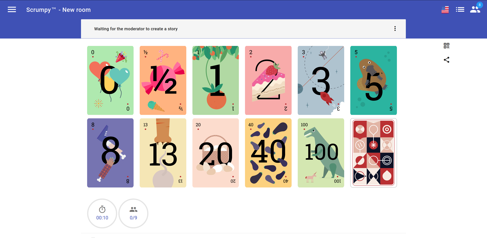

# <i>Product Backlog</i>

O <i>Product Backlog</i> é um artefato que permite a visualização dinâmica e completa de todos os requistos do projeto, ou seja, todas as atividades que devem ser realizadas ao longo do projeto, priorizadas de acordo com o valor de esforço para implementá-las. No contexto do <b>Visualeasy</b>, o <i>Product Backlog</i> foi divido em: Épicos, <i>Features</i> e <i>User Stories</i>.

Em um <i>Brainstorming</i> feito pela equipe, foram definidos: 4 épicos; 12 <i>Features</i>; e 34 <i>User Stories</i>. O artefato pode ser visualizado a seguir.

 

<iframe src="https://docs.google.com/spreadsheets/d/e/2PACX-1vQwmUtX6SdBjGwR0TnPJqhPQjEUtTOkhYm3c7kd7c0gcWERvStYG0WO0mBOl3YRTlx9yeGUbrdQTEEn/pubhtml?widget=true&amp;headers=false" width="100%" style="height: 100vh;"></iframe>

 

## Planning Poker

Depois de definir as <i>User Stories</i>, a equipe definiu os pontos por história. Para isso, foi utilizada a técnica de <i>Planning Poker</i>, para estimar o nível de esforço a ser gasto em cada <i>User Story</i>. O grupo utilizou a ferramenta <a href = "https://play-game.scrumpypoker.com">Scrumpypoker</a> para realizar rodadas de estimativas de esforço, que foi classificado com pontuações de 1 a 13, para cada <i>User Story</i>.

 

<figure>

 
</figure>

 

### Versionamento

| Data | Versão | Descrição | Autor(es) |
|------|------|------|------|
|19/07/2022|1.0|Adiciona documento sobre o <i>Product Backlog</i>|[Bruna Santos](https://github.com/brunaalmeidasantos), [Damarcones Porto](https://github.com/damarcones)|
|30/08/2022|1.1|Refatora <i>Product Backlog</i>|[Bruna Santos](https://github.com/brunaalmeidasantos)|