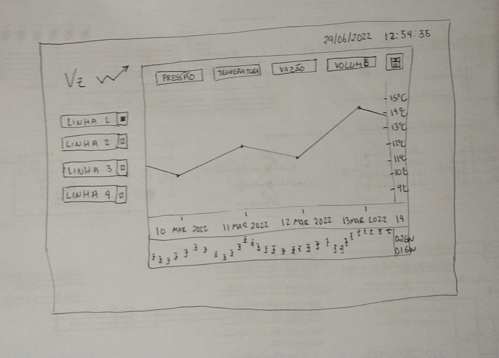
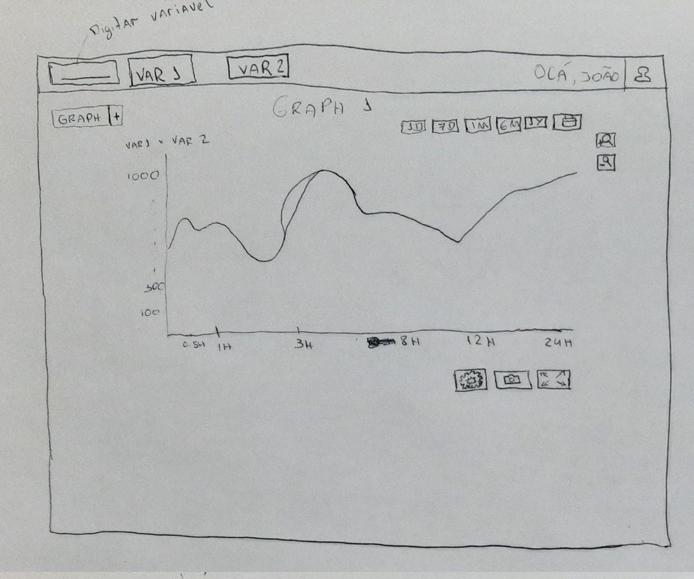

# Protótipo de Baixa Fidelidade

Para melhor interatividade e visualização do cliente, foi sugerido para os membros do grupo que fizessem uma representação ilustrativa de como seria a aplicação.

Imagens desenhadas pelos membros do grupo na reunião de 29/06/2022

### Bruna Almeida

### Bruno Carmo

### Damarcones Porto

### Estevão Reis

### Itallo Gravina

### João Pedro

### Luis Bruno

### Marcos Vinicius
