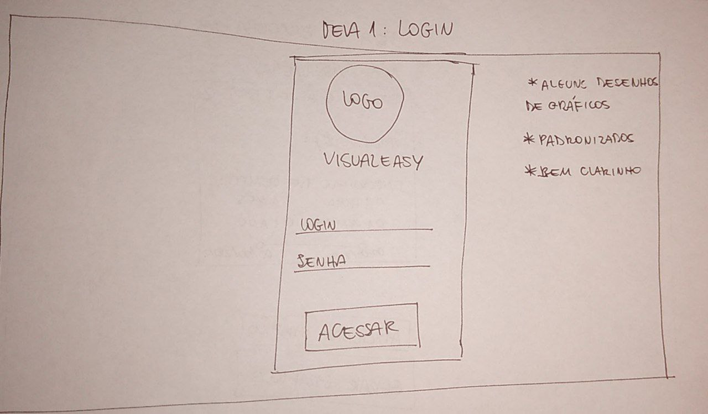
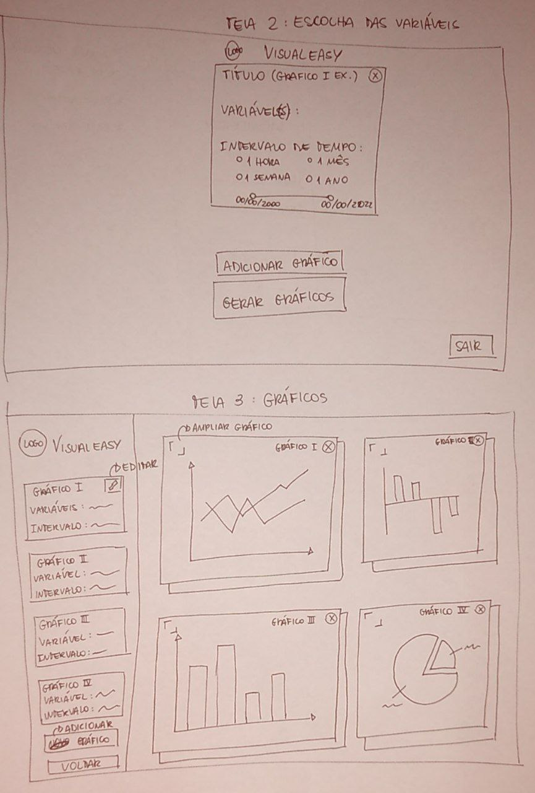
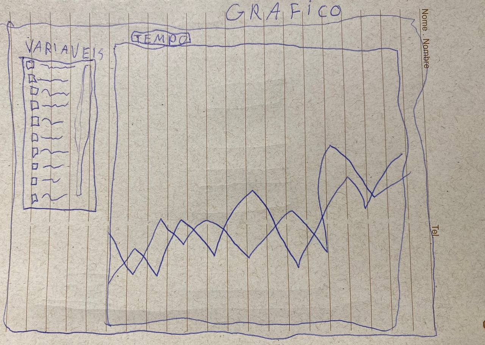

# Protótipo de Baixa Fidelidade

O protótipo de baixa de fidalidade do Visualeasy possui 3 versões; Cada versão é detalhada nos tópicos a seguir.

## 1ª Versão

Na 1ª versão do protótipo, para melhor interatividade e visualização do cliente, foi sugerido para os membros do grupo que fizessem uma representação ilustrativa de como seria a aplicação. Sendo assim, cada membro da equipe desenhou a sua visão da interface do Visualeasy. Seguidamente são apresentadas as imagens desenhadas pelos membros do grupo na reunião de 29/06/2022.

### Bruna Almeida

### Bruno Carmo

### Damarcones Porto

### Estevão Reis

### Itallo Gravina

### João Pedro

### Luis Bruno

### Marcos Vinicius

## 2ª Versão

Após discussão entre a equipe sobre os pontos positivos e negativos de cada desenho, uma nova versão foi criada, imprementando as sugestões de cada integrante da equipe.  

 A segunda versão do protótipo contém quatro telas: tela de login; tela para criar gráfico; tela com os gráficos gerados; e uma modal para editar os dados dos gráficos. A versão 2 do protótipo está apresentada a seguir.

## 3ª Versão

Após nova discussão entre os integrantes da equipe, um novo protótipo foi desenhado, com o objetivo de otimizar a navegabilidade dos usuários, diminuindo o número de telas. Essa última versão contém apenas duas telas: tela de login - que não foi desenhada novamente, pois será usada a tela desenhada na segunda versão -; e uma tela principal onde o usuário pode criar gráficos, visualizá-los e editá-los. A terceira versão encontra-se abaixo. 

 

## Versionamento

| Data | Versão | Descrição | Autor(es) |
|------|------|------|------|
|29/06/2022|1.0|Adiciona 1ª versão do protótipo de baixa fidelidade do projeto|[Bruno Nunes](https://github.com/brunocmo)|
|16/07/2022|1.1|Adiciona 2ª e 3ª versões do protótipo de baixa fidelidade do projeto|[Bruna Santos](https://github.com/brunaalmeidasantos), [Luis Bruno](https://github.com/lbrunofidelis), [Damarcones Porto](https://github.com/damarcones)|