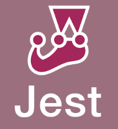

# Documento de Qualidade

### Objetivo

 Este documento objetiva explicitar os critérios, ferramentas e o planejamento da qualidade de código do projeto, esclarecendo o como, quais e porquês das adoções de cada tipo de teste durante o desenvolvimento do produto.

###	Planejamento

 Visando uma boa qualidade de código do projeto, alguns padrões de qualidade de corpos de conhecimentos e de normas foram definidos e também as ferramentas que serão utilizadas para monitorar essa qualidade. Neste contexto, a qualidade será afirmada através da aplicação de testes unitários, testes estáticos e testes de usabilidade.

 

## <b>Testes Unitários</b>

 A aplicação de testes unitários se dá por meio da implementação de testes da menor parte testável de um programa Para o NodeJS escolhemos o Jest, que é uma <em>framework</em> que permite realizar testes no nodejs de forma simples. Os testes são executados tanto no escopo das models, como no escopo dos controllers de cada microsserviço.

 

## <b>Testes Estáticos</b>

A análise estática de <em>softwares</em>, também conhecida como whitebox, trabalha diretamente com o código. Nesse caso, os componentes são verificados sem que o produto seja executado. No Visualeasy estão sendo usadas ferramentas automatizadas onde o principal objetivo dessa técnica é identificar erros de programação como práticas ruins, erros de sintaxe, identação entre outros. As ferramentas utilizadas serão o o ESLiny e o SonarCloud.

### ESLint

O ESLint é uma ferramenta de análise de código estática para identificar padrões problemáticos encontrados no código JavaScript. As regras no ESLint são configuráveis ​​e regras personalizadas podem ser definidas e carregadas.

Para o código em Javascript utilizamos os padrões do linter ESLint 7.10.0 tanto no frontend (Next.js-ReactJS), como no backend (NodeJS).

 

### SonarCloud

A utilização do Sonarcloud visa: Gerar métricas e indicadores técnicos, abrir o resultado de testes para que todo o time tenha acesso, e utilizar seus dados para melhora na qualidade de código.

 

## <b>Testes de Usabilidade</b>

### Introdução

A execução de testes de usabilidade baseia-se na aplicação da técnica de validação utilizada para avaliar um produto ou serviço. Os testes são realizados com usuários representativos do público-alvo. No caso da aplicação Visualeasy, os testes serão efetuados com o cliente logo após o lançamento de cada <i>Release</i>.

### Planejamento

Os testes de usabilidade serão feitos a partir da validação de novas funcionalides com os clientes, durante as reuniões semanais com os <i>POS</i> do VisualEasy; e, uma vez que a aplicação esteja online, serão coletados dados de utilização e <i>feedback</i> sobre a aplicação por parte do cliente.

Durante a execução dos testes de qualidade em uso, serão analisadas questões quanto à UX, a ISO25010 detalhada no documento de [Arquitetura](https://fga-eps-mds.github.io/2022-1-Visualeasy-Doc/documentacao/arquitetura/), e se os artefatos entregues atendem à solução proposta. Por questões de padronização, os dados coletados serão registrados em tabelas, como no exemplo a seguir.

|História de Usuário|Funcionalidade Implementada|<i>Feedback</i> do cliente| O artefato atende à necessidade do usuário?|Quais características de Qualidade a funcionalidade apresenta?|
|-------------------|---------------------------------|--------------------------|-----|-----|
|00|Exemplo de história de usuário|Exemplo de funcionalidade implementada|Exemplo de <i>feedback</i> do cliente|Sim/Não/Parcialmente|Compatibilidade, Confiabilidade, etc|

### Execução dos testes

Os resultados dos testes de Qualidade em Uso serão relatados no documento de [Relatório de Execução e Resultados dos Testes de Qualidade em Uso](https://fga-eps-mds.github.io/2022-1-Visualeasy-Doc/documentacao/relatorio-qualidade/).

 
 

### Referências

* Software Quality. Disponível em: [Software Quality](https://asq.org/quality-resources/software-quality#:~:text=Software%20quality%20is%20defined%20as,defect%20management%20and%20quality%20attributes). Acesso em 20 de Julho de 2022.
* Jest.org. Disponível em: [Jest](https://jestjs.io/pt-BR/). Acesso em 20 de Julho de 2022.
* SonarCloud. Disponível em: [Sonarcloud](https://jestjs.io/pt-BR/). Acesso em 20 de Julho de 2022.
* ESLint. Disponível em: [ESLint](https://eslint.org/). Acesso em 20 de Julho de 2022.

## Versionamento

| Data | Versão | Descrição | Autor(es) |
|------|------|------|------|
|14/07/2022|1.0|Adiciona documento de qualidade do projeto|[Bruno Nunes](https://github.com/brunocmo), [Marcos Vinicius](https://github.com/marcos-mv)
|25/07/2022|1.1|Revisão ortográfica do documento| [Gustavo Moreira](https://github.com/gustavoduartemoreira)
|14/08/2022|1.2|Refatora tópico de testes de Qualidade em Uso|[Bruna Santos](https://github.com/brunaalmeidasantos), [Damarcones Porto](https://github.com/damarcones)|