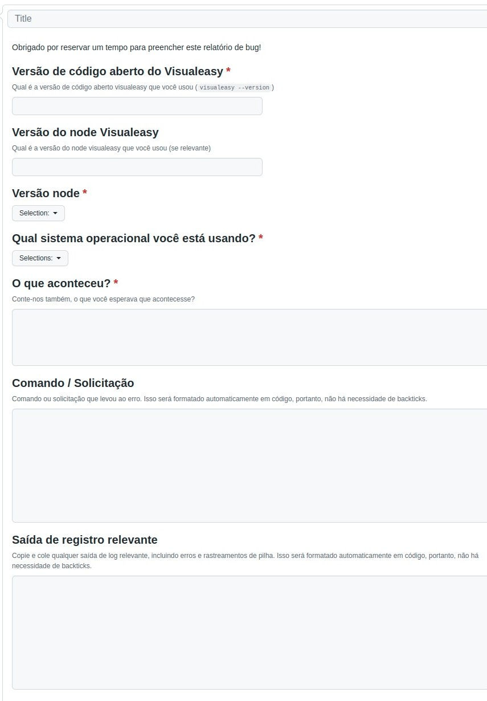

# Política de Issues

 Para a criação de issues nesse projeto deverão ser utilizados os templates disponibilizados no repositório, em casos de sugestão de implementação de um recurso (Feature request) ou de relatório de erros (Bug report), e caso não se encaixe nos dois tipos citados, deverá seguir outras políticas presentes no projeto. 
  
Além disso, os critérios a seguir também devem ser seguidos:

- A <i>issue</i> deverá ser atribuida a pelo menos um colaborador do projeto, através do recurso Assignees.
- A <i>issue</i> deverá possuir labels e milestone correspondentes, com a finalidade de manter a rastreabilidade.

## Templates

### Feature Request

### Bug Report

## Versionamento

| Data | Versão | Descrição | Autor(es) |
|------|------|------|------|
|23/06/2022|1.0|Política de Issues|[itallo Gravina](https://github.com/itallogravina)|
|10/08/2022|1.1|Adição dos templates|[João Pedro Moura](https://github.com/Joao-Pedro-Moura)|
