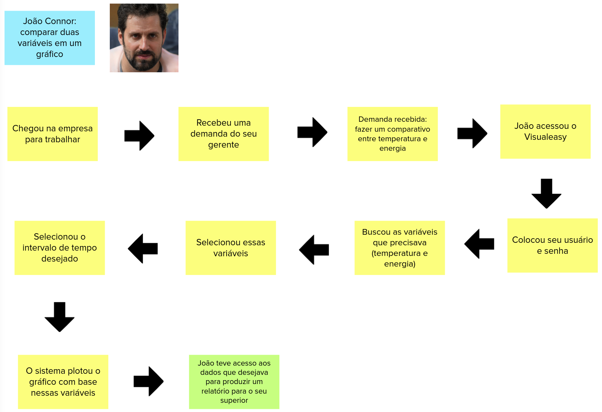
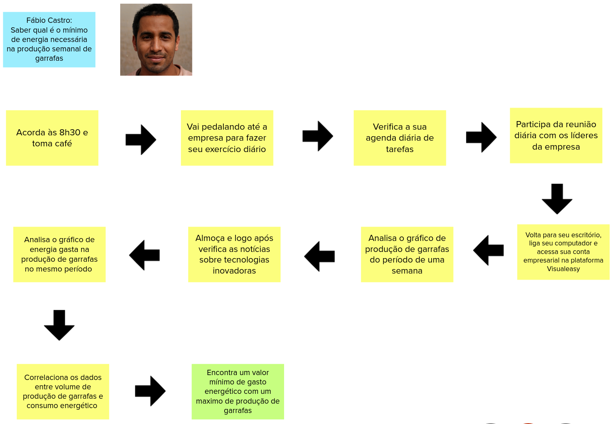

# Jornada do Usuário

Na atividade 5 do <i>Lean Inception</i>, o objetivo da equipe foi desenvolver jornadas de usuáŕio para as três personas criadas na atividade anterior. A jornada do usuário consiste na representação gráfica das etapas que envolvem o relacionamento do cliente com um produto ou serviço.

Novamente, a equipe foi dividida em três grupos, e cada grupo ficou responsável pela jornada de uma persona. Cada jornada levou em consideração o perfil e os objetivos de cada persona, e são apresentadas a seguir.

 

### Jornada de Usuário da Persona João Connor

 

### Jornada de Usuário da Persona Fábio Castro

 

### Jornada de Usuário da Persona Diana Gales

