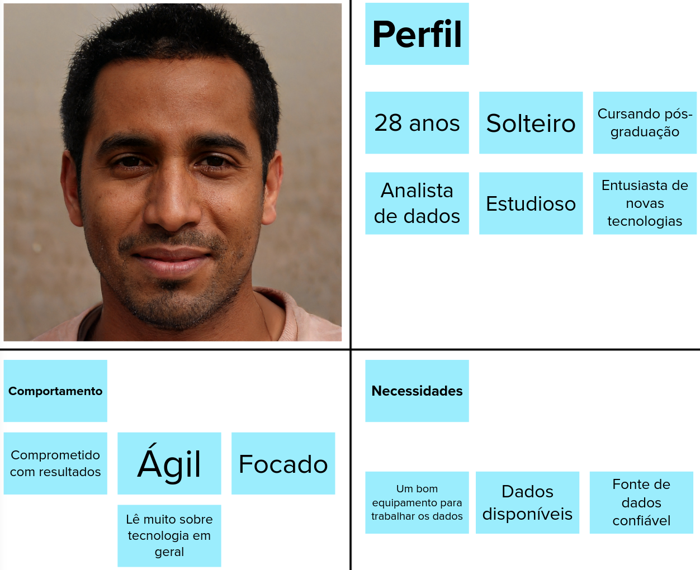

# Personas

A atividade 5 consistiu em criar as personas para o projeto <b>Visualeasy</b>.Cooper (1999) define persona como um personagem fictício, arquétipo hipotético de um grupo de usuários reais, criada para descrever um usuário típico. É utilizada principalmente para representar um grupo de usuários finais durante discussões de design, mantendo todos focados no mesmo alvo. As personas são definidas principalmente por seus objetivos. (Barbosa e Silva, 2010).

Para realizar esta atividade, a equipe foi novamente dividida em três grupos, e cada grupo desenvolveu uma persona. Os detalhes de cada uma das três personas criadas para o projeto são descritas seguidamente.

 

### Persona 1: <b>João Connor</b>

 

### Persona 2: <b>Fábio Castro</b>

 

### Persona 3: <b>Diana Gales</b>

